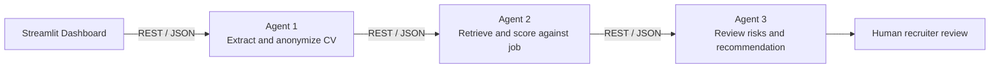

# HireWise

HireWise is a three-agent HR shortlisting system for privacy-aware, explainable
first-stage candidate matching. Agent 1 extracts and anonymizes CV information,
Agent 2 matches the anonymous profile to a persisted job, and Agent 3 reviews
confidence, privacy, fairness, risk, and recommendation signals. HireWise is a
decision-support tool only: the AI never makes the final hiring decision; a
human recruiter does.

## Architecture



The FastAPI application exposes the agent and pipeline contracts. SQLite is the
default database, and ChromaDB stores the knowledge-base documents used by
Agent 2 retrieval.

## Prerequisites

- Python 3.10 or newer.
- Windows PowerShell (the commands below use Windows paths).
- The spaCy model `en_core_web_sm`.

## Windows setup

Run these commands from the project root:

```powershell
python -m venv .venv
.venv\Scripts\Activate.ps1
python -m pip install -r requirements-backend.txt
python -m pip install -r requirements-frontend.txt
python -m spacy download en_core_web_sm
Copy-Item .env.example .env
python scripts/seed_knowledge_base.py
```

The seed command loads the documents in `knowledge_base/docs/` into the
ChromaDB knowledge base. Configure `.env` before running the application,
especially `SECRET_KEY`, `ENCRYPTION_KEY`, and `API_BASE_URL` for a non-default
environment.

## Run the application

Start the backend from the project root:

```powershell
uvicorn backend.main:app --reload --port 8000
```

In a second PowerShell terminal, activate the same virtual environment and
start the Streamlit dashboard:

```powershell
.venv\Scripts\Activate.ps1
Set-Location frontend
streamlit run app.py
```

The backend is available at `http://127.0.0.1:8000` and the dashboard at the
Streamlit URL shown in the terminal, normally `http://localhost:8501`.

## Tests

From the project root, with the virtual environment activated:

```powershell
python -m pytest tests -q
```

## API endpoints

- `GET /health` - backend readiness check.
- `POST /api/agent1/process` and `POST /api/agent1/process-batch` - extract and anonymize CVs.
- `POST /api/agent2/jobs` - create a persisted job.
- `GET /api/agent2/jobs/{job_id}/requirements` - extract job requirements.
- `POST /api/agent2/match` - score an anonymous candidate against a job.
- `POST /api/pipeline/run` - run the three-agent pipeline for uploaded CVs.
- `POST /api/pipeline/fairness-test` - compare a paired CV submission.
- `GET /api/jobs/{job_id}/candidates` - list ranked candidates for a job.
- `GET /api/candidates/{candidate_id}` - get candidate detail and review data.
- `POST /api/candidates/{candidate_id}/decision` - save a human decision.
- `GET /api/audit/{candidate_id}` - read a candidate audit trail.
- `GET /api/audit-chain/verify` - verify the audit hash chain.

## Responsible AI features

- Agent 1 removes personal and sensitive identity details before matching.
- Agent 3 performs an independent privacy check and reports risk flags.
- Recommendations are decision support; recruiter review is always required.
- The dashboard leaves the final decision to a human recruiter.
- Audit entries and hash-chain verification help detect later changes.
- The fairness test compares two qualification-matched CVs with different identity details.
- Score breakdowns, skill gaps, uncertain matches, and explanations support review.

## Contributors

| Contributor | Ownership |
| --- | --- |
| Contributor 1 | Agent 1: candidate intelligence and privacy |
| Contributor 2 | Agent 2: job matching and retrieval |
| Contributor 3 | Agent 3: responsible decision review and dashboard integration |
